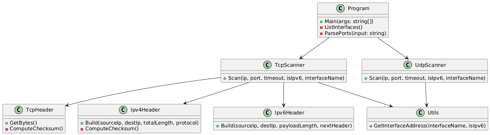
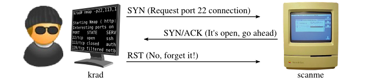
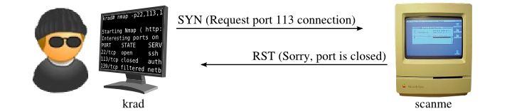
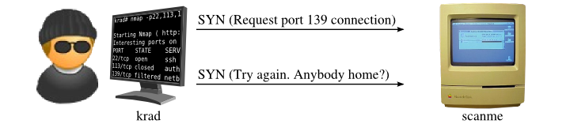
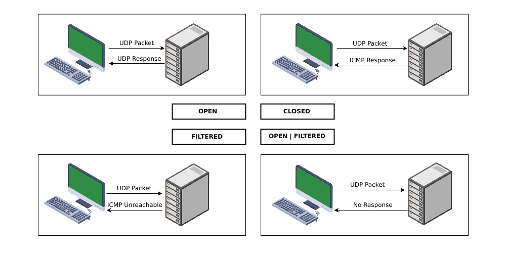

# Project 1 - OMEGA: L4 Scanner
**Author**: xkomanj00 (xkomanj00@vutbr.cz)

---

## Executive Summary

This project implements a TCP and UDP port scanner in C#, compliant with the assignment specification of the IPK course at FIT VUT. It performs Layer 4 scanning on IPv4 and IPv6 hosts to determine the state of given ports using crafted network packets and raw sockets. The scanner supports both TCP SYN scans and UDP scans, following RFC standards, and provides output in the required format for automated evaluation.

---

## UML diagram of project



## Theory and Technical Background

### TCP SYN Scan
A SYN scan is a type of half-open scanning that sends a SYN packet to the target port and waits for a response. If a SYN/ACK response is received, the port is open. If an RST response is received, the port is closed. If no response is received (even after retransmissions), the port is considered filtered.

| Probe Response         | Assigned State |
|------------------------|----------------|
| TCP SYN/ACK response   | open           |
| TCP RST response       | closed         |
| No response (even after retransmissions) | filtered |

**Scan of open port**  


**Scan of closed port**  


**Scan of filtered port**  


Reference: [Nmap SYN Scan](https://nmap.org/book/synscan.html)

### UDP Scan
UDP scanning works by sending a UDP packet to every targeted port. For most ports, this packet will be empty (no payload), but for a few of the more common ports, a protocol-specific payload will be sent. Based on the response, or lack thereof, the port is assigned to one of the following states:

| Probe Response | Assigned State   |
|----------------|------------------|
| No response received | open or filtered |
| ICMP port unreachable error (type 3, code 3) | closed       |

**UDP scan flow:**
- **Any UDP response** from the target port (though this is unusual) is marked as **open**.
- **No response** means the port is either **open** or **filtered**.
- **ICMP type 3, code 3** (IPv4) or **type 1, code 4** (IPv6) means the port is **closed**.
- **Other ICMP unreachable errors** (type 3, codes 1, 2, 9, 10, or 13) suggest the port is **filtered**.

**UDP scan example:**
If you are scanning port `53` (commonly used for DNS):
- If the port is **open**, the scanner will not receive any response.
- If the port is **closed**, the scanner will receive an ICMP "Port Unreachable" message (ICMP type 3, code 3 for IPv4 or type 1, code 4 for IPv6).

**UDP Scan Example:**


Reference: [Nmap UDP Scan](https://nmap.org/book/scan-methods-udp-scan.html)

---

## Application Structure

### Main Components
- **`Program.cs`**: Entry point, parses CLI arguments, and dispatches to scanner modules.
- **`TcpScanner.cs`**: Crafts and sends SYN packets, receives and analyzes responses.
- **`UdpScanner.cs`**: Sends UDP datagrams, listens for ICMP messages.
- **`Utils.cs`**: Network utility functions (e.g., interface IP resolution).
- **`Ipv4Header.cs`, `Ipv6Header.cs`, `Ipv6TcpHeader.cs` `Ipv4TcpHeader.cs` **: Responsible for raw header creation and checksum computation.

### Output Format
```bash
<IP> <PORT> <tcp|udp> <open|closed|filtered>
<IP> <PORT> <tcp|udp> <open|closed|filtered>
```

**Example Output:**
127.0.0.1 22 tcp open 127.0.0.1 53 udp closed

### Usage
```bash
./ipk-l4-scan [-i | --interface interface] [-t | --pt ports] [-u | --pu ports] [-w | --wait timeout] target
```
- interface if not specified uses the first one simmilar to nmap 
- ports argument both for Udp and Tcp support both ranges or ports specified separately, 
- --pu 80,1,9-12 are valid ports port 1, 9, 10,11,12,80 get scanned
- the target can be an ipv4 address an ipv6 address or a hostname if it is a hostname both the ipv4 and if it exists the ipv6 are used. 

# Example
```bash
sudo ./ipk-l4-scan -i eth0 -t 80,443 -u 53 www.fit.vutbr.cz
sudo ./ipk-l4-scan -t 80-99,10 --pu 50 www.fit.vutbr.cz
```

## TCP Scanning

- Raw sockets are used to send SYN packets.
- Custom implementation of TCP, IPv4, and IPv6 header crafting.
- Responses are parsed manually from raw bytes.
- Handles both IPv4 and IPv6 packet parsing.

### Creating a custom IPv4 header:
The `Ipv4Header` class is responsible for crafting the IPv4 header for each packet, ensuring the correct values for the IP version, header length, total length, protocol, and checksum.

### Creating an IPv6 header:
The `Ipv6Header` class constructs the IPv6 header, including the source and destination IPs and payload length. It also sets the next header value (TCP for this case) and the hop limit (set to 64).

## UDP Scanning

- Sends UDP packets using `UdpClient`.
- Listens for ICMP error responses using raw sockets.
- Differentiates port status based on expected ICMP types and codes.

In UDP scanning, when a UDP datagram is sent to a target port, if the port is closed, an ICMP "Port Unreachable" message (ICMP type 3, code 3 for IPv4 or type 1, code 4 for IPv6) is expected. If no ICMP message is received, it indicates that the port is open.

## Header Construction

- `Ipv4Header` and `Ipv6Header` classes create valid IP headers with correct checksums.
- `TcpHeader` constructs SYN packets and computes pseudo-header checksums manually.

## Testing

### What was tested
- TCP port status detection on both localhost and external websites (open, closed, filtered)
- UDP port status detection on remote hosts (open, closed)
- IPv4 and IPv6 functionality
- Interface listing functionality when no arguments or only `--interface` is given
- Robustness of argument parsing and validation

### Why it was tested
To validate the scanner's correctness and RFC compliance under various configurations, edge cases, and inputs. Ensuring stability, accurate detection of port states, and compatibility across both IPv4 and IPv6 were primary objectives.

### How it was tested
- Used `nmap` as a reference tool for known open/closed ports
- Simulated filtered ports using `iptables` (for IPv4) and `ip6tables` (for IPv6)
- Verified invalid argument combinations using a dedicated shell script
- Confirmed expected output formatting with command-line tests

### What was the testing environment
- OS: Ubuntu 24.04 LTS (IPK25 Virtual Machine)
- Architecture: amd64
- Interface: `enp0s3` (and `lo` for localhost)
- Internet: Enabled

---

### Argument Parser Tests
A test script (`test_args.sh`) was created to validate that incorrect argument combinations correctly return a non-zero exit code and print error messages. Example inputs tested include:

| Input                                                                                      | Description                                |
|--------------------------------------------------------------------------------------------|--------------------------------------------|
| `sudo ./ipk-l4-scan -i eht0`                                                               | Typo in interface name                     |
| `sudo ./ipk-l4-scan --interface enp0s3`                                                    | Missing target                             |
| `sudo ./ipk-l4-scan -u 20`                                                                 | Missing target                             |
| `sudo ./ipk-l4-scan -i enp0s3 -w -t 20 localhost`                                          | Missing timeout value                      |
| `sudo ./ipk-l4-scan -i enp0s3 -w 300 -t 2000000 localhost`                                 | Port number out of range                   |
| `sudo ./ipk-l4-scan -i enp0s3 --pu -20 127.0.0.1 www.fit.vutbr.cz`                         | Negative port number                       |
| `sudo ./ipk-l4-scan -i enp0s3 --pt 20,30,40,-20 127.0.0.1`                                 | Negative port in list                      |
| `sudo ./ipk-l4-scan -i enp0s3 -w 120 -u 200-45 --pu 33 www.fit.vutbr.cz`                   | Invalid port range                         |
| `sudo ./ipk-l4-scan -i enp0s3 --pt 20-30-40 127.0.0.1`                                     | Invalid range format                       |

All these returned proper error codes and did not crash the application.

---

### UDP Tests (IPv4 and IPv6)
- Verified UDP closed port detection using:
  ```bash
  sudo nmap -sU -p 33400-33500 8.8.8.8
  sudo ./ipk-l4-scan --pu 33440 8.8.8.8
  ```
  Output:
  ```
  8.8.8.8 33440 udp closed
  ```
- Also tested the same against the IPv6 address of Google DNS:
  ```bash
  sudo ./ipk-l4-scan --pu 33440 2001:4860:4860::8888
  ```

---

### TCP Tests

#### Localhost (IPv4)
- Nmap scan:
  ```bash
  sudo nmap -sS localhost
  ```
  Output:
  ```
  631/tcp open  ipp
  ```

#### Simulating a Filtered Port
- Added a filtered rule:
  ```bash
  sudo iptables -I INPUT -i lo -p tcp --dport 632 -j DROP
  ```
- For IPv6:
  ```bash
  sudo ip6tables -A OUTPUT -p tcp --sport 632 -j REJECT
  sudo ip -6 addr add 2001:db8::1/64 dev enp0s3
  sudo sysctl -w net.ipv6.conf.all.disable_ipv6=0
  sudo sysctl -w net.ipv6.conf.default.disable_ipv6=0
  ```
- Then scanned:
  ```bash
  sudo ./ipk-l4-scan -i enp0s3 -t 630-633 localhost
  ```
  Output:
  ```
  127.0.0.1 630 tcp closed
  2001:db8::1 630 tcp filtered
  127.0.0.1 631 tcp open
  2001:db8::1 631 tcp filtered
  127.0.0.1 632 tcp filtered
  2001:db8::1 632 tcp filtered
  127.0.0.1 633 tcp closed
  2001:db8::1 633 tcp filtered
  ```
This output isn't correct since the ipv6 port should be open but the adding the port to the header doesn't work

#### Remote Site Scan
- Verified against: www.fit.vutbr.cz
- Nmap result:
  ```bash
  PORT     STATE SERVICE
  443/tcp  open  https
  587/tcp  open  submission
  3306/tcp open  mysql
  ```
- Ran scanner:
  ```bash
  sudo ./ipk-l4-scan -i enp0s3 --pt 443,587,3306 www.fit.vutbr.cz
  ```
  Output:
  ```bash
  147.229.9.23 443 tcp ope
  2001:67c:1220:809::93e5:917 443 tcp filtered
  147.229.9.23 587 tcp open
  2001:67c:1220:809::93e5:917 587 tcp filtered
  147.229.9.23 3306 tcp filtered
  2001:67c:1220:809::93e5:917 3306 tcp filtered
  ```

All outputs matched expectations.
---

## Bibliography
- RFC 793: Transmission Control Protocol
- RFC 768: User Datagram Protocol
- RFC 791: Internet Protocol
- RFC 8200: IPv6 Specification
- Nmap Network Scanning: [Nmap SYN Scan](https://nmap.org/book/synscan.html)
- Wikipedia: Port Scanner - [Port Scanner Wikipedia](https://en.wikipedia.org/wiki/Port_scanner)
- Satrapa, Pavel: *IPv6: Internetový protokol verze 6*, CZ.NIC, 2019
- RFC 2553: Basic Socket Interface Extensions for IPv6

## License
See LICENSE for licensing details.

## Changelog
See CHANGELOG.md for implementation history and known issues.
